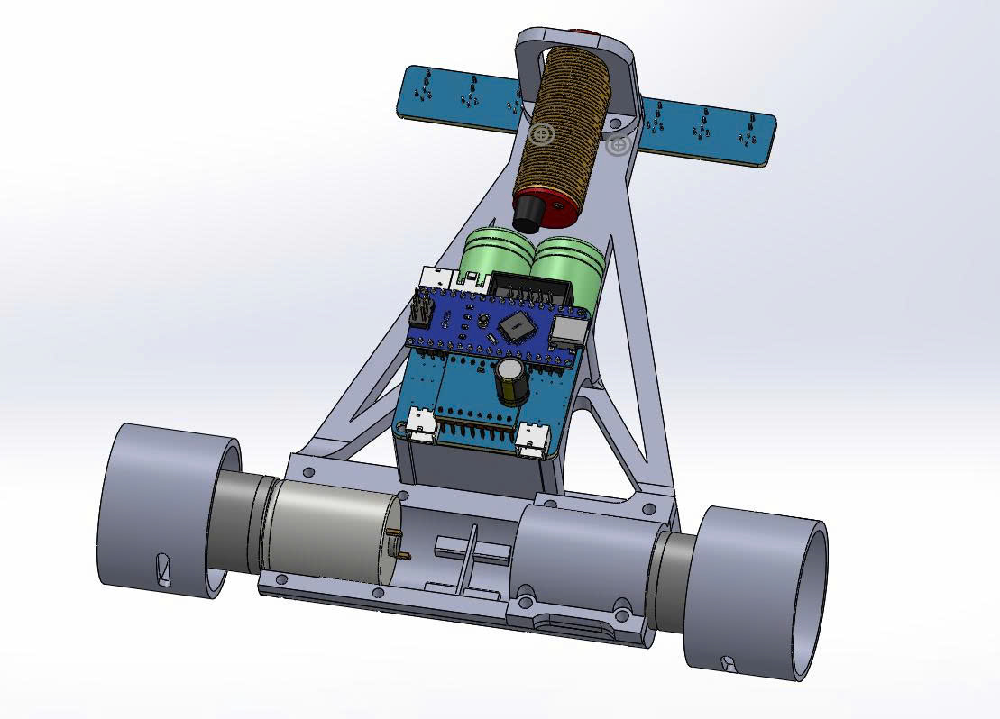

# Line Following Robot - Algorithm Documentation



## 📋 Tổng quan

Robot dò line sử dụng 8 cảm biến hồng ngoại với thuật toán PID để di chuyển theo đường line đen. Ngoài ra, robot còn có khả năng tránh vật cản sử dụng cảm biến NPN.

## 🔧 Cấu hình phần cứng

### Chân kết nối:
- **Cảm biến line**: A0-A7 (8 cảm biến analog)
- **Cảm biến vật cản**: Pin 2 (NPN_SENSOR_PIN)
- **Động cơ trái**: 
  - AIN1 (Pin 8), AIN2 (Pin 7)
  - PWMA (Pin 6)
- **Động cơ phải**:
  - BIN1 (Pin 4), BIN2 (Pin 3)
  - PWMB (Pin 5)
- **Nút điều khiển**:
  - SW1 (Pin 12), SW2 (Pin 9)
  - DIPSTW1 (Pin 10), DIPSTW2 (Pin 11)
- **Buzzer**: Pin 13

### Ánh xạ cảm biến:
```
sensorValue[7] ← A0 (trái ngoài cùng)
sensorValue[6] ← A2
sensorValue[5] ← A1
sensorValue[4] ← A4
sensorValue[3] ← A3
sensorValue[2] ← A6
sensorValue[1] ← A5
sensorValue[0] ← A7 (phải ngoài cùng)
```

## ⏱️ Timer Interrupt

### Cấu hình Timer 2:
- **Prescaler**: 1024
- **TCNT2**: 0xB2 (178)
- **Overflow**: 256 - 178 = 78 counts
- **Tần số ngắt**: (78 × 1024) / 16MHz ≈ **5ms**
- **Tần số đọc cảm biến**: **200 Hz**

Trong mỗi lần ngắt:
- Đọc giá trị 8 cảm biến
- Tính toán PID
- Tăng biến đếm `cnt`

## 🧮 Thuật toán PID

### 1. Calibration (Tự động chuẩn hóa)

Khi `isCalib = 1`, hệ thống tự động:
```cpp
if (black_value[i] == 0) black_value[i] = 1100;  // Khởi tạo
if (sensorValue[i] < black_value[i]) black_value[i] = sensorValue[i];  // Tìm min
if (sensorValue[i] > white_value[i]) white_value[i] = sensorValue[i];  // Tìm max
compare_value[i] = (black_value[i] + white_value[i]) / 2;  // Ngưỡng
```

### 2. Chuẩn hóa giá trị cảm biến

```cpp
sensorPID[j] = map(sensorValue[j], black_value[j], white_value[j], 0, 1000);
```
- Giá trị đen (line) → 0
- Giá trị trắng (nền) → 1000

### 3. Tạo byte sensor (binary representation)

```cpp
sensor = 0bXXXXXXXX  // 8 bit, mỗi bit đại diện cho 1 cảm biến
// Bit = 1 nếu cảm biến > compare_value (phát hiện trắng)
// Bit = 0 nếu cảm biến < compare_value (phát hiện đen/line)
```

**Ví dụ**:
- `0b00011000` = Line ở giữa (sensor 3, 4)
- `0b00000001` = Line ở phải ngoài cùng
- `0b10000000` = Line ở trái ngoài cùng
- `0b00011111` = Ngã tư (5 sensor phải phát hiện line)

### 4. Tính vị trí line (Weighted Average)

```cpp
avg = Σ(sensorPID[j] × j × 1000)  // j = 0..7
sum = Σ(sensorPID[j])
position = (avg / sum) - 3500
```

**Giải thích**:
- Vị trí trung tâm lý tưởng: (0+1+2+3+4+5+6+7)/8 × 1000 = 3500
- `position < 0`: Line lệch về phải
- `position > 0`: Line lệch về trái
- `position = 0`: Line ở chính giữa

### 5. Điều khiển PID

```cpp
kp = 2.0      // Hệ số tỷ lệ
kd = 15       // Hệ số vi phân

iP = kp × position                    // Phần tỷ lệ
iD = kd × (lastPos - position)        // Phần vi phân
iRet = iP - iD                        // Tổng điều khiển

if (iRet < -4000) iRet = 0;          // Giới hạn quá âm
servoPwm = iRet / 25                  // Chia tỷ lệ
```

**Ý nghĩa**:
- **P (Proportional)**: Điều chỉnh mạnh khi lệch nhiều
- **D (Derivative)**: Giảm dao động, làm mượt chuyển động
- `servoPwm > 0`: Rẽ trái
- `servoPwm < 0`: Rẽ phải

### 6. Áp dụng vào động cơ

```cpp
speedLeft = baseSpeed - servoPwm
speedRight = baseSpeed + servoPwm
```

## 🎮 Chế độ hoạt động

### Khởi động (start = 0)

#### Chế độ 1: DIPSTW1=HIGH, DIPSTW2=HIGH
- **SW1**: Bắt đầu từ case 10
- **SW2**: Bắt đầu từ case 11

#### Chế độ 2: DIPSTW1=LOW, DIPSTW2=LOW
- **SW1**: Bắt đầu từ case 14 (test ngã 4)
- **SW2**: Bắt đầu từ case 341 (test tránh vật cản)

## 🗺️ Sơ đồ thuật toán chính

### 📍 Luồng Line Following (Case 10-19)

```
Case 10: Chờ 2.25s
    ↓
Case 11: Chạy line (150) → Phát hiện ngã tư đầu tiên (5 sensor)
    ↓
Case 13: Tiến + rẽ nhẹ phải (100ms)
    ↓
Case 214-216: Quét phải tìm line mới
    ↓
Case 14: Chạy line → Phát hiện ngã 4
    ↓
Case 15-151: Quét trái qua ngã 4
    ↓
Case 141: Chạy line → Kiểm tra vật cản
    ↓ (không có vật cản)
Case 142-143: Điều chỉnh vị trí + quét phải
    ↓
Case 16: Chạy line → Phát hiện mất line (sensor = 0x00)
    ↓
Case 17-18: Quay phải tìm line
    ↓
Case 19: Chạy line
    ↓ (nếu sensor = 0xf0 → Case 100: DỪNG)
    ↓ (nếu timeout 500ms)
Case 34-351: Xử lý ngã 4 thứ 2
    ↓
Case 341: Vào chế độ tránh vật cản
```

### 🚧 Luồng Tránh Vật Cản (Case 341-352)

```
Case 341: Chạy line + kiểm tra NPN sensor
    ↓ (phát hiện vật cản)
Case 342: Lùi xe (400ms)
    ↓
Case 343: Quay phải tại chỗ (250ms)
    ↓
Case 344: Tiến thẳng (1750ms) - đi vòng qua vật cản
    ↓
Case 345: Quay trái tại chỗ (600ms)
    ↓
Case 348: Tiến đến khi gặp line
    ↓
Case 349: Tiến thêm (350ms)
    ↓
Case 350: Quay phải tìm line chính giữa
    ↓
Case 352: Chạy line bình thường
```

**Hình dạng quỹ đạo tránh vật cản**:
```
    ┌─────────┐
    │ Vật cản │
    └─────────┘
         ▲
    3    │    1
    ┌────┴────┐
    │         │
  4 └─────────┘ 2
       Line
```
1. Phát hiện → Lùi
2. Quay phải
3. Tiến dài (vượt vật cản)
4. Quay trái (về song song với line)
5. Tìm lại line

## 📊 Bảng mã sensor quan trọng

| Mã Binary | Hex | Ý nghĩa |
|-----------|-----|---------|
| `0b00011000` | 0x18 | Line ở giữa (sensor 3,4) |
| `0b00111100` | 0x3C | Line ở giữa rộng (sensor 2,3,4,5) |
| `0b00001111` | 0x0F | Ngã tư phải (4 sensor phải) |
| `0b00011111` | 0x1F | Ngã tư phải đầy đủ (5 sensor phải) |
| `0b11110000` | 0xF0 | Ngã tư trái (4 sensor trái) |
| `0b11111000` | 0xF8 | Ngã tư trái đầy đủ (5 sensor trái) |
| `0b11111100` | 0xFC | 6 sensor trái |
| `0b11000011` | 0xC3 | Line ở 2 đầu |
| `0b00000000` | 0x00 | Mất line hoàn toàn |

## ⚙️ Tham số điều chỉnh

### PID Parameters:
```cpp
kp = 2.0    // Tăng → phản ứng mạnh hơn, dễ dao động
kd = 15     // Tăng → mượt hơn, giảm overshoot
divider = 25 // servoPwm = iRet / 25 - Tăng → chuyển hướng nhẹ hơn
```

### Tốc độ:
```cpp
Case 11, 141: 150-180  // Tốc độ chạy line thường
Case 16: 100           // Tốc độ chậm (gần điểm đặc biệt)
Case 341: 100          // Tốc độ khi kiểm tra vật cản
```

### Thời gian (cnt × 5ms):
```cpp
cnt = 80  → 400ms
cnt = 100 → 500ms
cnt = 350 → 1750ms
```

## 🛠️ Hàm chính

### `read_sensor()`
- Đọc 8 cảm biến analog
- Chuẩn hóa giá trị (0-1000)
- Tạo byte sensor
- Tính PID
- Cập nhật servoPwm

### `speed_run(left, right)`
- Điều khiển 2 động cơ
- Giới hạn tốc độ (-255 đến 255)
- Âm = lùi, Dương = tiến

### `handleAndSpeed(angle, speed)`
- `speedLeft = speed - angle`
- `speedRight = speed + angle`
- Điều khiển xe rẽ trong khi di chuyển

### `runforwardline(speed)`
- Wrapper cho `handleAndSpeed(servoPwm, speed)`
- Chạy line với tốc độ cho trước

### `sensorMask(mask)` & `sensorE()`
- Kiểm tra trạng thái sensor với bit mask
- `sensorE()`: Trả về toàn bộ byte sensor

## 🔍 Debug

Uncomment để debug:
```cpp
// Trong loop():
Serial.print(sensor, BIN);
Serial.print(" | Servo PWM: ");
Serial.println(servoPwm);

// Trong update_sensor():
Serial.println(sensor, BIN);
```

## 📝 Lưu ý

1. **Calibration tự động**: Để xe trên line trắng, bật calibration mode để tự học giá trị min/max
2. **Điều kiện cắt PID**: `if (iRet < -4000) iRet = 0` - chỉ cắt giá trị âm quá lớn
3. **Timer interrupt**: Không dùng `delay()` trong ISR
4. **Biến volatile**: `cnt`, `servoPwm`, `sensor`, `lastPos` - dùng chung giữa ISR và main

## 🎯 Kịch bản sử dụng

### Test cơ bản:
1. Set DIPSTW = HIGH-HIGH
2. Nhấn SW1 → Chạy từ đầu (case 10)
3. Nhấn SW2 → Chạy từ ngã tư đầu (case 11)

### Test ngã 4:
1. Set DIPSTW = LOW-LOW
2. Nhấn SW1 → Test ngã 4 (case 14)

### Test tránh vật cản:
1. Set DIPSTW = LOW-LOW
2. Nhấn SW2 → Test obstacle avoidance (case 341)

---

**Tác giả**: Line Following Robot Project  
**Ngày cập nhật**: 23/10/2025  
**Phiên bản**: 2.0
